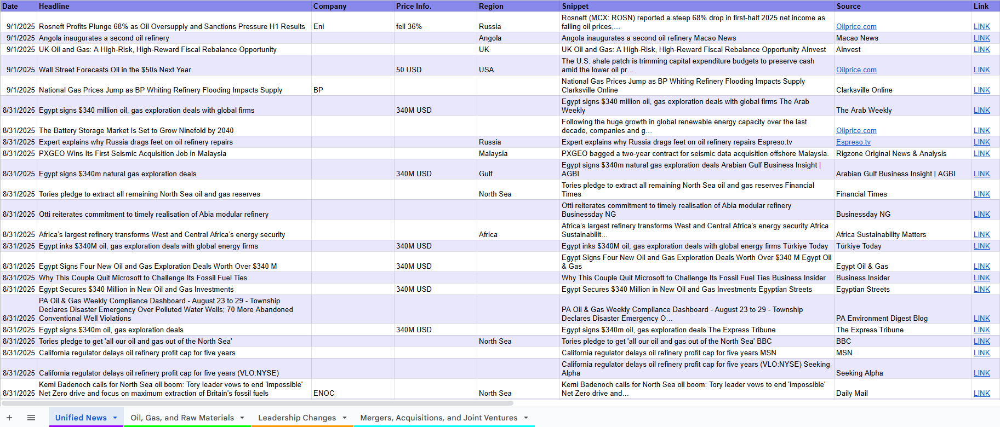
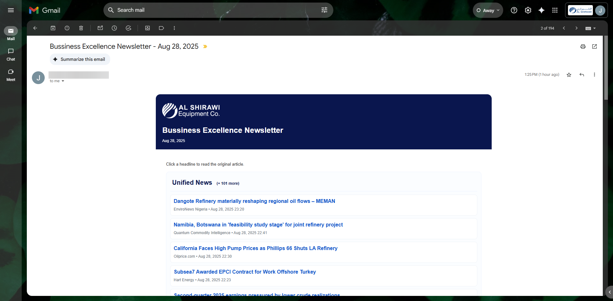
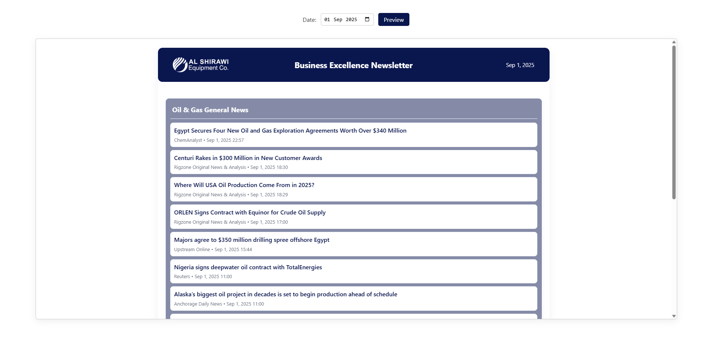

<h1 align="center">🛢️ OilGas-Wire</h1>

<p align="center">
  
</p>

<p align="center">
  A project for
  <br/>
  
</p>

Automatic newsletter generator and RSS/Atom aggregator built on Google Apps Script. It fetches configured feeds, normalizes items into a Google Sheet, and renders a daily HTML newsletter (email + optional web preview).

<p align="center">


</p>

---

## 👷‍♂️ How it works

1. Feed ingestion: `Feed.gs` fetches and parses feeds listed in `Config.gs`. New items are normalized and written to sheet tabs defined by `Config`.
2. Mailer: `AutoMailer.gs` builds visible sections (using `buildVisibleSectionsForDate`), renders `Newsletter_Mail.html`, and sends the daily email via `sendDailyNewsletter()`.
3. Web preview: `doGet(e)` in `AutoMailer.gs` / web handlers renders `Newsletter_Web.html` for a requested date. Deploy as a Web App to expose a permalink.

---

## ⚙️ Configuration (Script Properties)

Key properties (set in Project Settings → Script properties):

| Property                     | Description                                                                                                                                                                      | Required / Notes                           |
| ---------------------------- | -------------------------------------------------------------------------------------------------------------------------------------------------------------------------------- | ------------------------------------------ |
| `SHEET_ID`                   | ID of the Google Sheet that stores feed tabs and feed data                                                                                                                       | Required                                   |
| `ANALYTICS_SPREADSHEET_ID`   | (Deprecated) Spreadsheet ID where analytics events are logged (Analytics_Events, Analytics_Daily). Prefer `ANALYTICS_ENDPOINT`.                                                  | Optional - deprecated                      |
| `ANALYTICS_ENDPOINT`         | URL of an analytics endpoint that accepts `POST` `/track` JSON events (recommended). Example: a deployed `newsletter-analytics-service`                                          | Recommended (for robust tracking)          |
| `ANALYTICS_LOG_USER`         | When set to `true`, the webapp will attach the server-side active user's email (Session.getActiveUser().getEmail()) to events sent to `ANALYTICS_ENDPOINT`. Use with care (PII). | Optional (default: false)                  |
| `ANALYTICS_SECRET`           | Some secret string ([base64](https://www.base64encode.org/)) to perform very basic [HMAC](https://en.wikipedia.org/wiki/HMAC)                                                    | Recommended (for tracking)                 |
| `ANALYTICS_SEND_MAPPINGS`    | When set to `true`, the mailer will `POST` incremental rid->email mappings to the analytics backend during sends.                                                                | Optional (default: false)                  |
| `ANALYTICS_SEND_PLAIN_EMAIL` | When set to `true`, the mailer will `POST` incremental rid->email mappings **in plaintext** to the analytics backend during sends.                                               | Optional (default: false)                  |
| `SEND_TO`                    | Comma-separated list of recipient emails for the newsletter                                                                                                                      | Required unless `TEST_RECIPIENT` is set    |
| `TEST_RECIPIENT`             | Sends newsletter only to this address (overrides `SEND_TO`), useful for testing                                                                                                  | Optional (use for safe testing)            |
| `WEBAPP_URL`                 | Deployed Web App URL used for the web preview and analytics `POST` fallback                                                                                                      | Optional (set to enable web preview links) |
| `MAX_ITEMS_PER_SECTION`      | How many items to show in each section in the email preview (default: 6)                                                                                                         | Optional (default: 6)                      |

If `WEBAPP_URL` is set, outgoing emails include a "View full newsletter" link that points to the web preview.

---

## 🚀 Deployment (Web App)

1. Open the project in the Apps Script editor.
2. Deploy → New deployment → choose "Web app".
3. Set "Execute as" to `Me`. Choose access according to whether you want public view (Anyone) or authenticated access.
4. Copy the returned URL and set it to `WEBAPP_URL` in Script properties.

Once deployed, recipients can open `WEBAPP_URL?date=YYYY-MM-DD` to view a full newsletter page.

---

## 📈 Analytics & Web Tracking

This project includes lightweight analytics for clicks, page views and active time:

- `WebAnalytics.gs` exposes a `doPost(e)` JSON API that accepts `logEvent` and `logActiveTime` actions and forwards them to `logEventApi` / `logActiveTimeApi`.
- `SharedAnalytics.gs` provides `sendAnalyticsEvent()` which POSTs a normalized JSON payload to `ANALYTICS_ENDPOINT` when configured. This is the recommended way to collect analytics. If `ANALYTICS_ENDPOINT` is not set the function logs an error and is a no-op.

More details on the backend service can be found in [`newsletter-analytics-service`](newsletter-analytics-service/README.md).

> [!WARNING]
> The mail analytics and sheet analytics are not fully implemented due to limitations with email clients and GAS. The mail analytics code is present in `MailAnalytics.gs` but do not work reliably.

<br/>

> [!NOTE]
> Prefer setting `ANALYTICS_ENDPOINT` to an HTTP(S) endpoint that accepts `POST` `/track` JSON events (the repo includes a sample service in `newsletter-analytics-service/`).
>
> If you still rely on spreadsheet-based analytics, `ANALYTICS_SPREADSHEET_ID` is still supported but deprecated — the codebase now prefers POSTing events to `ANALYTICS_ENDPOINT`.

<br/>

> [!CAUTION]
> If you enable `ANALYTICS_LOG_USER=true`, the webapp will attempt to attach the server-side active user's email address to analytics events. This exposes personally-identifiable information (PII) to your analytics backend and may have legal/privacy implications depending on your jurisdiction and policy. Only enable if you have consent and a clear retention policy.

<br/>

> [!TIP]
> Example curl for posting to the analytics endpoint included with this repo (replace with your deployed URL):

```bash
curl -X POST "<your analytics url>/track" \
  -H "Content-Type: application/json" \
  -d '{"src":"source","eventType":"test","eventDetail":"test-details","durationSec":"25","newsletterId":"someID","url":"example.com","recipientHash":"hashed-id","ua":"user-agent-string"}'
```

---

## 💻 Development notes

- Templates: `Newsletter_Mail.html` and `Newsletter_Web.html` use Apps Script scriptlets (`<?= ... ?>`) — edit in the Apps Script editor or via `clasp`.
- Web endpoints: `WebAnalytics.gs` handles web GET/POST (pixel, redirects, pings) and routes JSON POSTs to `logEventApi` / `logActiveTimeApi`.
- Analytics helpers: `SharedAnalytics.gs` (event row format, HMAC helpers), `SheetsAnalytics.gs` (sheet-side helpers), and `MailAnalytics.gs` (mailer link signing) live under `src/Analytics/`.
- If you add scopes (Sheets API, UrlFetch, etc.), update `appsscript.json` and re-authorize.

---

## ▶️ How to run / test

### Local / [`clasp`](https://github.com/google/clasp)

> [!NOTE]
> [Node.js](https://nodejs.org/en/download) is required to run any of the follwoing commands.

1. Clone this repo:

    ```bash
    git clone https://github.com/joejo-joestar/OilGas-Wire.git
    cd OilGas-Wire
    ```

2. Run these commands:

    ```bash
    npm i
    ```

    ```bash
    clasp login
    ```

    ```bash
    clasp pull
    ```

    ```bash
    clasp push
    ```

3. Open the project in the Apps Script editor.

### In Apps Script editor

1. Set [Script properties](#️-configuration-script-properties) (`SHEET_ID`, `ANALYTICS_SPREADSHEET_ID`, `WEBAPP_URL`, etc.).
2. Populate the feed config sheet (tab named `Feed_Config`) with feed URLs and target sheet tabs.
3. In `Utils/Debug.gs`, run the `testRun()` function to fetch feeds and populate the sheet.
4. [Deploy the web app](#-deployment-web-app) and visit `WEBAPP_URL?preview=1` to preview the full HTML.
5. Run `sendDailyNewsletter` to test sending (use `TEST_RECIPIENT` during tests).

### Testing analytics

- Open the web preview and click headlines. The page will attempt to POST tracking payloads (check the browser Network panel).
- Confirm `Analytics_Events` (sheet) or `Analytics_Debug` (if enabled) receives rows.

### Scheduling

- In Apps Script editor: Triggers → Add Trigger → choose `sendDailyNewsletter` → Time-driven → Day timer → set hour.

---

## 🗃️ Project Structure

```text
OilGas-Wire/
├── README.md
├── assets/
├── newsletter-analytics-service/  # The GCP service for analytics
│   ├── Dockerfile
│   ├── package.json
│   ├── index.js
│   ├── newsletter_analytics.*.json  # BigQuery schema files
│   ├── newsletter_analytics.*.sql   # BigQuery create table queries
│   └── README.md
└── newsletter-scripts/  # The main Apps Script project
    ├── appsscript.json
    ├── package.json
    ├── AutoMailer.gs
    ├── Config.gs
    ├── Feed.gs
    ├── IDFScoreGen.gs
    ├── Newsletter_Mail.html
    ├── Newsletter_Web.html
    ├── Styles_Common.html
    ├── Styles_Email.html
    ├── Styles_Web.html
    ├── Triggers.gs
    ├── Web_Preview.html
    ├── Analytics/  # Analytics-related scripts
    │   ├── MailAnalytics.gs
    │   ├── SheetsAnalytics.gs
    │   ├── SharedAnalytics.gs
    │   └── WebAnalytics.gs
    └── Utils/
        ├── Analysis.gs
        ├── Debug.gs
        ├── FeedUtils.gs
        ├── SheetUtils.gs
        ├── TextUtils.gs
        └── UnitTests.gs
```

---

## ✨ Features

- Aggregates RSS/Atom feeds and writes normalized rows to Google Sheets.
- Generates a daily HTML newsletter (email + web app) with configurable sections.

<p align="center">

</p>

- Web app includes client-side tracking (page views, headline clicks, active time) that writes to an analytics spreadsheet.
- A lightweight preview UI (`WebPreview.html`) served by the web app for manual QA. Visit the webapp with `?preview=1` to open a date picker and preview rendered HTML for any date.

<p align="center">

</p>

- Uses TF-IDF scoring to identify and sort by relevant articles (see `IDFScoreGen.gs`).

---
