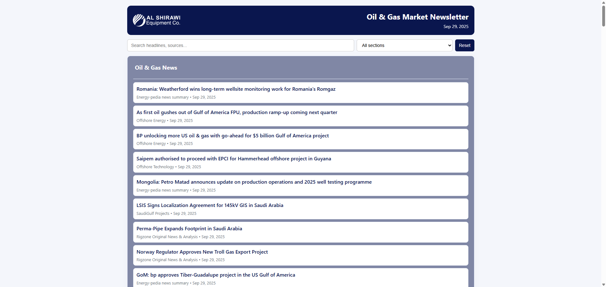
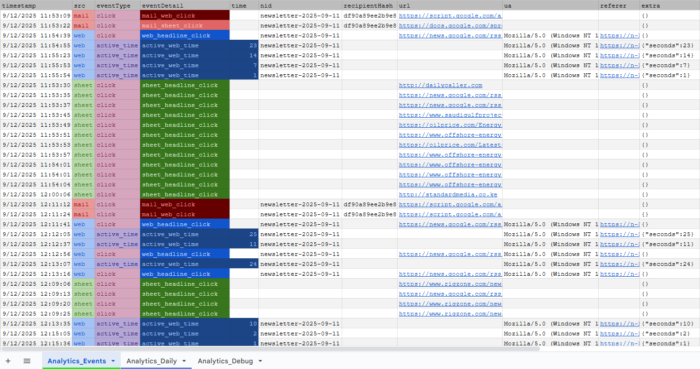

<h1 align="center">🛢️ OilGas-Wire</h1>

<p align="center">
  
</p>

<p align="center">
  A project for
  <br/>
  
</p>

Automatic newsletter generator and RSS/Atom aggregator built on Google Apps Script. It fetches configured feeds, normalizes items into a Google Sheet, and renders a daily HTML newsletter (email + optional web preview).

<p align="center">


</p>

---

## 👷‍♂️ How it works

1. Feed ingestion: `Feed.gs` fetches and parses feeds listed in `Config.gs`. New items are normalized and written to sheet tabs defined by `Config`.
2. Mailer: `AutoMailer.gs` builds visible sections (using `buildVisibleSectionsForDate`), renders `Newsletter_Mail.html`, and sends the daily email via `sendDailyNewsletter()`.
3. Web preview: `doGet(e)` in `AutoMailer.gs` / web handlers renders `Newsletter_Web.html` for a requested date. Deploy as a Web App to expose a permalink.

---

## ⚙️ Configuration (Script Properties)

Key properties (set in Project Settings → Script properties):

| Property                   | Description                                                                                                                   | Required / Notes                           |
| -------------------------- | ----------------------------------------------------------------------------------------------------------------------------- | ------------------------------------------ |
| `SHEET_ID`                 | ID of the Google Sheet that stores feed tabs and feed data                                                                    | Required                                   |
| `ANALYTICS_SPREADSHEET_ID` | Spreadsheet ID where analytics events are logged (Analytics_Events, Analytics_Daily)                                          | Recommended (for tracking)                 |
| `ANALYTICS_SECRET`         | Some secret string ([base64](https://www.base64encode.org/)) to perform very basic [HMAC](https://en.wikipedia.org/wiki/HMAC) | Recommended (for tracking)                 |
| `SEND_TO`                  | Comma-separated list of recipient emails for the newsletter                                                                   | Required unless `TEST_RECIPIENT` is set    |
| `TEST_RECIPIENT`           | Sends newsletter only to this address (overrides `SEND_TO`), useful for testing                                               | Optional (use for safe testing)            |
| `WEBAPP_URL`               | Deployed Web App URL used for the web preview and analytics POST fallback                                                     | Optional (set to enable web preview links) |
| `MAX_ITEMS_PER_SECTION`    | How many items to show in each section in the email preview (default: 6)                                                      | Optional (default: 6)                      |

If `WEBAPP_URL` is set, outgoing emails include a "View full newsletter" link that points to the web preview.

---

## 🚀 Deployment (Web App)

1. Open the project in the Apps Script editor.
2. Deploy → New deployment → choose "Web app".
3. Set "Execute as" to `Me`. Choose access according to whether you want public view (Anyone) or authenticated access.
4. Copy the returned URL and set it to `WEBAPP_URL` in Script properties.

Once deployed, recipients can open `WEBAPP_URL?date=YYYY-MM-DD` to view a full newsletter page.

---

## 📈 Analytics & Web Tracking

This project includes lightweight analytics for clicks, page views and active time:

- `WebAnalytics.gs` exposes a `doPost(e)` JSON API that accepts `logEvent` and `logActiveTime` actions and forwards them to `logEventApi` / `logActiveTimeApi`.
- `SharedAnalytics.gs` provides `logAnalyticsEvent()` which writes structured rows to the `Analytics_Events` sheet (and a daily aggregate table).

<p align="center">

</p>

- `Newsletter_Web.html` now includes a `trackClick(payload)` helper that:
  - Uses `google.script.run` when served by HtmlService, or
  - Uses `navigator.sendBeacon` to POST JSON to `WEBAPP_URL`, falling back to `fetch()` if needed.

>[!WARNING]
> The mail analytics and sheet analytics are not fully implemented due to limitations with email clients and GAS. The mail analytics code is present in `MailAnalytics.gs` but do not work reliably.

<br/>

>[!NOTE]
> Set `ANALYTICS_SPREADSHEET_ID` to enable event writes. The code uses `computeHmacHex` / `verifyHmacHex` helpers if you later add signed redirects.

>[!TIP] Future Scope
> You can implement a separate backend for more robust analytics, e.g. using Google Cloud Functions + Firestore or BigQuery.

---

## 💻 Development notes

- Templates: `Newsletter_Mail.html` and `Newsletter_Web.html` use Apps Script scriptlets (`<?= ... ?>`) — edit in the Apps Script editor or via `clasp`.
- Web endpoints: `WebAnalytics.gs` handles web GET/POST (pixel, redirects, pings) and routes JSON POSTs to `logEventApi` / `logActiveTimeApi`.
- Analytics helpers: `SharedAnalytics.gs` (event row format, HMAC helpers), `SheetsAnalytics.gs` (sheet-side helpers), and `MailAnalytics.gs` (mailer link signing) live under `src/Analytics/`.
- If you add scopes (Sheets API, UrlFetch, etc.), update `appsscript.json` and re-authorize.

---

## ▶️ How to run / test

### Local / [`clasp`](https://github.com/google/clasp)

1. clone this repo:

    ```bash
    git clone https://github.com/joejo-joestar/OilGas-Wire.git
    ```

2. cd into the directory

3. run these commands:

    ```bash
    npm i
    ```

    ```bash
    clasp login
    ```

    ```bash
    clasp pull
    ```

    ```bash
    clasp push
    ```

4. Open the project in the Apps Script editor.

### In Apps Script editor

1. Set [Script properties](#️-configuration-script-properties) (`SHEET_ID`, `ANALYTICS_SPREADSHEET_ID`, `WEBAPP_URL`, etc.).
2. Populate the feed config sheet (tab named `Feed_Config`) with feed URLs and target sheet tabs.
3. In `Utils/Debug.gs`, run the `testRun()` function to fetch feeds and populate the sheet.
4. [Deploy the web app](#-deployment-web-app) and visit `WEBAPP_URL?preview=1` to preview the full HTML.
5. Run `sendDailyNewsletter` to test sending (use `TEST_RECIPIENT` during tests).

### Testing analytics

- Open the web preview and click headlines. The page will attempt to POST tracking payloads (check the browser Network panel).
- Confirm `Analytics_Events` (sheet) or `Analytics_Debug` (if enabled) receives rows.

### Scheduling

- In Apps Script editor: Triggers → Add Trigger → choose `sendDailyNewsletter` → Time-driven → Day timer → set hour.

---

## 🗃️ Project Structure

```text
OilGas-Wire/
├── package.json
├── README.md
├── assets/
└── src/
    ├── appsscript.json
    ├── AutoMailer.gs
    ├── Config.gs
    ├── Feed.gs
    ├── IDFScoreGen.gs
    ├── Newsletter_Mail.html
    ├── Newsletter_Web.html
    ├── Styles_Common.html
    ├── Styles_Email.html
    ├── Styles_Web.html
    ├── Triggers.gs
    ├── Web_Preview.html
    ├── Analytics/
    │   ├── MailAnalytics.gs
    │   ├── SheetsAnalytics.gs
    │   ├── SharedAnalytics.gs
    │   └── WebAnalytics.gs
    └── Utils/
        ├── Analysis.gs
        ├── Debug.gs
        ├── FeedUtils.gs
        ├── SheetUtils.gs
        ├── TextUtils.gs
        └── UnitTests.gs
```

---

## ✨ Features

- Aggregates RSS/Atom feeds and writes normalized rows to Google Sheets.
- Generates a daily HTML newsletter (email + web app) with configurable sections.

<p align="center">

</p>

- Web app includes client-side tracking (page views, headline clicks, active time) that writes to an analytics spreadsheet.
- A lightweight preview UI (`WebPreview.html`) served by the web app for manual QA. Visit the webapp with `?preview=1` to open a date picker and preview rendered HTML for any date.

<p align="center">

</p>

- Uses TF-IDF scoring to identify and sort by relevant articles (see `IDFScoreGen.gs`).

---
