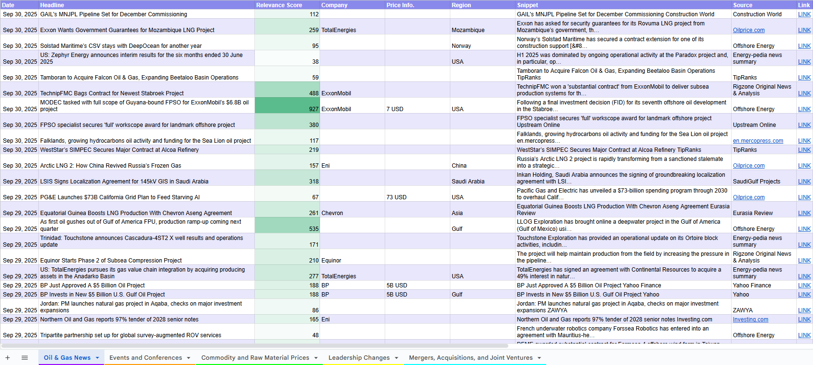
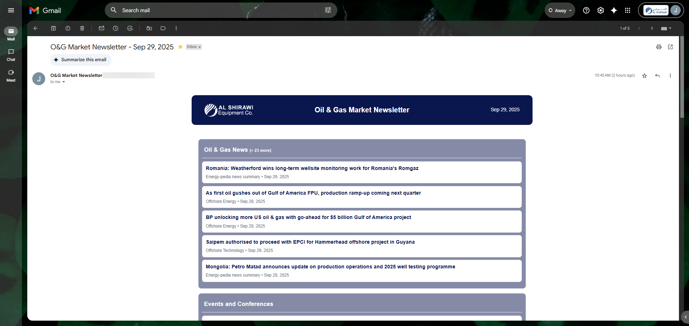

<h1 align="center">🛢️ OilGas-Wire</h1>

<p align="center">
  
</p>

A small Google Apps Script project that aggregates RSS/Atom feeds, filters items (company, region, commodity, industry, price hints), stores results in a Google Sheet, and generates a daily email newsletter with a web preview.

<p align="center">



</p>

---

## 🗂️ Project Structure

```plaintext
Oil-and-Gas-Newsletter-and-Feed
├── package.json                # Project metadata (dev tools)
├── README.md                   # This documentation
├── .claspignore                # git-like ignore file for clasp deployments
├── assets/                     # Static assets used by the repo
│   └── pixpagercar.png         # Small header/logo image used in README
└── src/                        # Apps Script source files
    ├── appsscript.json             # Apps Script manifest (scopes, entry points)
    ├── AutoMailer.gs               # Main mailer + webapp handlers (sendDailyNewsletter, doGet)
    ├── Config.gs                   # CONFIG array and feed tab mappings
    ├── Feed.gs                     # Feed aggregation / parsing logic
    ├── Newsletter_Template.html    # Template used for email and web preview
    ├── WebPreview.html             # Template used to preview newsletter HTML for any date
    └── Utils/                 # Small utility modules used by scripts
        ├── Analysis.gs        # Content analysis utilities (tagging, scoring)
        ├── Debug.gs           # Debug helpers and logging utilities
        ├── FeedUtils.gs       # Feed parsing helpers
        ├── SheetUtils.gs      # Spreadsheet helper functions (reads, ranges)
        ├── TextUtils.gs       # Text processing helpers (truncate, cleanup)
        └── UnitTests.gs       # Lightweight tests and smoke checks
```

---

## ✨ Features

- Daily newsletter email that includes a truncated preview of each section and a link to view the full newsletter.


- Web preview (Apps Script Web App) with permalink and optional `?date=YYYY-MM-DD` parameter to view historical newsletters.


- Template HTML (`Newsletter_Template.html`) used for the email body and web preview
- Intelligent link handling: extracts URLs from `=HYPERLINK()` formulas in the sheet so cells that display 'LINK' still open the real URL.
- Configurable behavior via script properties (`SEND_TO`, `TEST_RECIPIENT`, `MAX_ITEMS_PER_SECTION`, `WEBAPP_URL`, etc.).
- A lightweight preview UI (`WebPreview.html`) served by the web app for manual QA. Visit the webapp with `?preview=1` to open a date picker and preview rendered HTML for any date.
- `getNewsletterHtml(dateStr)` server function that returns rendered newsletter HTML for the requested date (used by the preview UI).
- `doGet(e)` now supports a `preview` mode (`?preview=1`) in addition to the existing `?date=YYYY-MM-DD` parameter.
- Drive publishing has been removed from the default mail flow - the web app renders live content directly from the sheet (no Drive files required).

---

## 👷‍♂️ How it works

1. Feeds are aggregated and stored in different sheet tabs as configured in [`Config.gs`](src/Config.gs). Each sheet should have a header row with recognizable column names like `date`, `headline`/`title`, `link`, `source`, `snippet`.
2. `sendDailyNewsletter()` reads the sheet rows for the target date (previous day by default), builds sections, renders [`Newsletter_Template.html`](src/Newsletter_Template.html), and sends a truncated HTML email.
3. A separate `doGet(e)` web handler renders the full newsletter for the requested date (defaults to previous day). Deploy this as a Web App to get a stable permalink.

---

## ⚙️ Configuration (Script Properties)

Set these in the Apps Script project (Project Settings → Script properties) or via the script:

- `SHEET_ID`: ID of the Google Sheet containing feed data (required)
- `SEND_TO`: comma-separated list of recipient emails (required unless `TEST_RECIPIENT` is set)
- `TEST_RECIPIENT`: when set, overrides `SEND_TO` and sends only to this address (useful for testing)
- `MAX_ITEMS_PER_SECTION`: number of items to include in the email preview (default 6)
- `WEBAPP_URL`: optional: set to your deployed webapp permalink. The mailer will append or substitute the date parameter (supports `{date}` placeholder). Example: `https://script.google.com/macros/s/XXX/exec` or `https://.../exec?d={date}`

> [!NOTE]
> By default the mailer uses the webapp URL (if set) as the "full newsletter" link in the email. If not set, no link is included.

---

## 🚀 Deployment (Web App)

1. Open the project in the Apps Script editor.
2. Deploy → New deployment → Select "Web app".
3. Set "Execute as" to `Me` and "Who has access" to `Anyone` or `Anyone with the link` (if you want viewers to open without signing in).
4. Copy the returned URL and set it as `WEBAPP_URL` in script properties (optionally include `{date}` where you want the date injected).

When the script sends a newsletter it will include a link to `WEBAPP_URL?date=YYYY-MM-DD` (or substitute `{date}`) so recipients can view the full newsletter in their browser.

---

## 💻 Development notes

- The templating in [`Newsletter_Template.html`](src/Newsletter_Template.html) uses Apps Script server-side scriptlets (`<?= ... ?>` and `<? ... ?>`): editing the file in the editor preserves evaluation.
- [`AutoMailer.gs`](src/AutoMailer.gs) contains utility functions `buildVisibleSectionsForDate(dateStr)` and `doGet(e)`: the latter is the web handler that accepts `?date=YYYY-MM-DD`.
- If you edit permissions/scopes, update `appsscript.json` accordingly and re-authorize the script when running.
